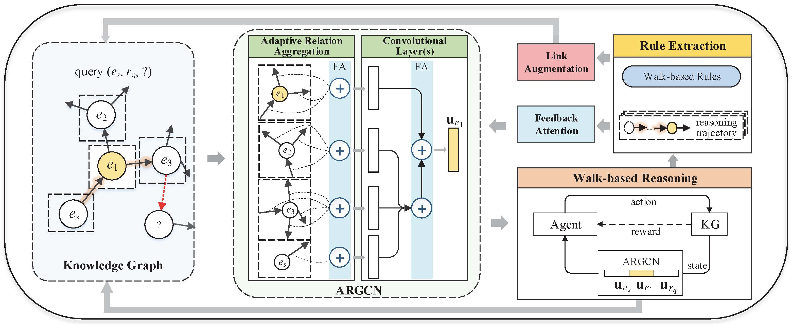

# Inductive Knowledge Graph Reasoning for Multi-batch Emerging Entities

This is the official code release of the following paper: 

Yuanning Cui, Yuxin Wang, Zequn Sun, Wenqiang Liu, Yiqiao Jiang, Kexin Han, Wei Hu. [Inductive Knowledge Graph Reasoning for Multi-batch Emerging Entities](https://arxiv.org/abs/2208.10378). CIKM 2022.




## Quick Start
### Installation

Install PyTorch following the instructions on the [PyTorch](https://pytorch.org/).
Our code is written in Python3.

Run the following commands to install the required packages:
```
pip install -r requirements.txt
```

### Dataset
```
unzip data.zip
```

It will generate three dataset folders in the ./data directory. In our experiments, the datasets used are: `WN-MBE`, `FB-MBE` and `NELL-MBE`.
In each dataset, there are six `add_x` folders, where `add_1` is the validation set of original KG, and `add_2~6` are emerging batches.

Following [Multi-Hop](https://github.com/salesforce/MultiHopKG/blob/master/data-release.tgz), the pagerank files are generated using the tool (https://github.com/timothyasp/PageRank). 

Update (2022.12.26): Delete the isolated entities in the validation sets. Now, there are 7636, 31406, and 18501 facts in the validation sets of WN-MBE, FB-MBE, and NELL-MBE, respectively.

### Training and evaluation
1. Train model
```
python src/experiments.py --train --dataset <dataset-name> --gpu <gpu-ID>
```
You can use following datasets: `WN-MBE`, `FB-MBE` and `NELL-MBE`.

During training, if you want to see the results on emerging batches, you can use the `--run_analysis`.
```
python src/experiments.py --train --run_analysis --dataset <dataset-name> --gpu <gpu-ID>
```
The model will be evaluated on both validation and emerging batch testing sets during training.
Note that due to the different density of entity links, there will be a gap between the results on the validation and test sets.

2. Evaluate model
```
python src/experiments.py --inference --dataset <dataset-name> --gpu <gpu-ID>
```
You can use following datasets: `WN-MBE`, `FB-MBE` and `NELL-MBE`.

### Change the hyperparameters
To change the hyperparameters and other experiment set up, start from the [parse_args files](src/parse_args.py) and [config files](src/config.py).

> If you have any difficulty or question in running code and reproducing experimental results, please email to yncui.nju@gmail.com.

## Citation
If you find the repository helpful, please cite the following paper
```bibtex
@inproceedings{cui2022inductive,
  title = {Inductive Knowledge Graph Reasoning for Multi-batch Emerging Entities},
  author = {Cui, Yuanning and 
            Wang, Yuxin and 
            Sun, Zequn and 
            Liu, Wenqiang and 
            Jiang, Yiqiao and 
            Han, Kexin and 
            Hu, Wei},
  booktitle = {CIKM},
  year = {2022}
}
```
